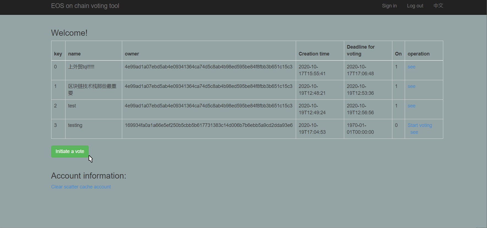
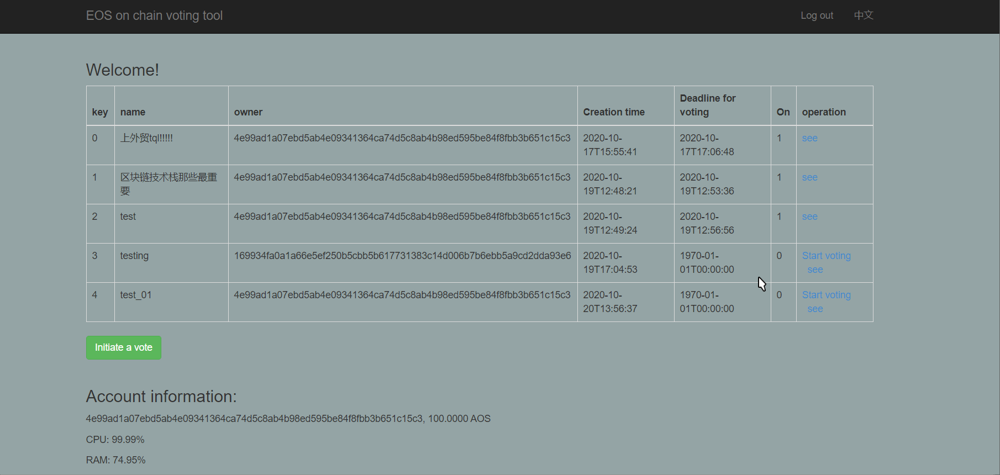

# 基于AOS的匿名投票系统

## 0 项目特性

- **智能合约创意新颖、设计巧妙和通用性强**

- **智能合约函数、事件、结构等设计规范性、合理性、执行效率与安全性**

- **代码编写简洁规范、可读性强，注释清晰准确**

- **多底层框架版本**

## 1 AOS 介绍

AOS是全球范围内性能最强的支持智能合约的隐私公链，支持用户发行隐私代币，被称为“隐私版的EOS”；AOS也是全球首个支持零知识证明编程的隐私公链，也被称为“隐私版的小程序开发平台”。

AOS开创和引领隐私区块链3.0时代，相较于Monero、ZCash、Dash等隐私货币，AOS支持用户自主发行隐私资产，实现了隐私资产发行层面的图灵完备。相较于其他普通的隐私智能合约平台，AOS首创性的支持零知识证明编程，实现了隐私应用编程层面的图灵完备，即支持用户轻松便捷的自主开发隐私应用。

## 2 项目概述

### 2.1 用户群体分析

需要进行投票表决的学校小团体、商业董事会群体、政府人员等。

### 2.2 用途概述及隐私性

没有调查就没有发言权,投票调查在我们的生活中扮演着重要的角色。线上投票系统具有环保、效率高等特点,因此线上投票系统被广泛使用。但是,现有的线上投票系统依然存在一些不容忽视的问题。比如系统的管理者可能会为了利益而恶意修改数据,系统可能遭受黑客的攻击。现有线上投票系统的公正性和安全性,完全依赖网站本身的安全和信誉度。而区块链具有去中心化、数据不可篡改、安全可信的特点,数据一旦存入区块链就无法篡改。区块链是不可篡改、真实可信的数据库,因此区块链技术正是保证投票系统公正性和安全性的最佳方案。并且投票方返回值与当前账户资料信息均由keccak256加密后输出至前端，保证了页面公开展示投票时的隐私。

## 3 接口分析及数据要求

- **addvote**

  **功能**：发起一次投票

  **参数：** account_name, vote_name

  | 变量名 | 类型  |        含义         |
  | :----: | :--: | :-----------------: |
  | account_name  | account | 调用该action的人  |
  |  vote_name  | string | 投票内容 |

- **startvote**

  **功能**：开始投票

  **参数：** account_name, vote_key

  | 变量名 | 类型  |        含义         |
  | :----: | :--: | :-----------------: |
  | account_name  | account | 调用该action的人  |
  |   vote_key  | uint64_t | 投票ID |

- **addproposal**

  **功能**：添加投票提案

  **参数：** account_name,vote_key,proposal_name

  | 变量名 | 类型  |        含义         |
  | :----: | :--: | :-----------------: |
  | account_name  | account | 调用该action的人  |
  |   vote_key  | uint64_t | 投票ID |
  |   proposal_name  | string | 投票内容 |

- **voteproposal**

  **功能**：投票给某个提议

  **参数：** account_name, proposal_key

  | 变量名 | 类型  |        含义         |
  | :----: | :--: | :-----------------: |
  | account_name  | account | 调用该action的人  |
  |  proposal_key  | uint64_t | 投票ID |

- **delvoteppsl**

  **功能**：删除给某个提议的投票

  **参数：** account_name, proposal_key

  | 变量名 | 类型  |        含义         |
  | :----: | :--: | :-----------------: |
  | account_name  | account | 调用该action的人  |
  |  proposal_key  | uint64_t | 投票ID |

- **winproposal**

  **功能**：返回投票数最多的提议

  **参数：** account_name, vote_key 

  | 变量名 | 类型  |        含义         |
  | :----: | :--: | :-----------------: |
  | account_name  | account | 调用该action的人  |
  |  vote_key  | uint64_t | 投票ID |

## 4 使用范例

1. 添加并开启一个投票

2. 启动投票，并使用另一个账号进行投票

## 6 总结与未来计划

- **改进合约使用aos公链底层技术原生实现匿名性**
- **优化前端页面做针对不同客户端的适配**

